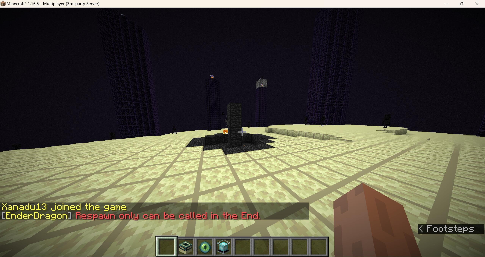

## Config

* world environment fix: `advanced_setting.world_env_fix` of `config.yml` -> `true`/`false`

## Function

In some mohist server, return value of `World::getEnvironment()` is always `NORMAL`, causing some problems of respawn function.

If enabled, plugin will provide hot-fix for it.

